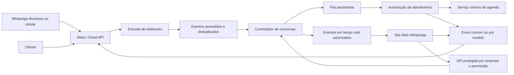

# Plano técnico — Web WhatsApp com Coexistência e separação por empresa

Data da análise: 23/07/2026  
Projeto: E o Bicho  
Escopo: tela Web WhatsApp, backend, Coexistência com o WhatsApp Business, atendimento humano/automático, agendamento e mensagens pós-serviço.

## Estado da implementação

### Etapa 1 — Base segura: implementada em 23/07/2026

- todas as rotas autenticadas do WhatsApp passam a validar o vínculo do usuário com a loja;
- operações com conversas, mensagens e perfil comercial validam se o número pertence à integração daquela loja;
- foi criado o endpoint seguro `GET /api/integrations/whatsapp/:storeId/environment`;
- funcionários comuns podem operar o ambiente autorizado, mas não alterar a integração;
- credenciais e PIN deixaram de ser devolvidos ao navegador;
- credenciais existentes são representadas apenas por indicadores `stored`;
- o registro manual com PIN foi desativado para não conflitar com o futuro fluxo de Coexistência;
- salas Socket.IO do WhatsApp exigem token, acesso à loja e número pertencente à loja;
- ao trocar de ambiente, a conexão sai das salas anteriores;
- a tela `WhatsApp` foi reconstruída como painel de configuração e saúde por loja;
- a tela `WebWhatsApp` passou a carregar o endpoint seguro de ambiente e autenticar o Socket.IO;
- foram adicionados testes unitários e de integração contra acesso cruzado entre lojas e números.

### Etapa 2 — Embedded Signup v4 e Coexistência: implementada em 23/07/2026

- a tela `WhatsApp` agora configura App ID, Configuration ID, App Secret e Verify Token por loja;
- App Secret, Verify Token e token de acesso são gravados criptografados e nunca são devolvidos ao navegador;
- o botão `Conectar com Coexistência` abre o Embedded Signup v4 oficial da Meta;
- cada tentativa gera uma sessão temporária vinculada à loja e ao administrador, com expiração e uso único;
- somente o evento `FINISH_WHATSAPP_BUSINESS_APP_ONBOARDING` é aceito;
- o código temporário é trocado por token exclusivamente no backend;
- o backend assina a WABA, confirma `is_on_biz_app=true` e `platform_type=CLOUD_API`;
- o fluxo pula intencionalmente o registro tradicional do número, preservando o WhatsApp Business no celular;
- as sincronizações `smb_app_state_sync` e `history` são iniciadas e acompanhadas separadamente;
- webhooks de `history`, `smb_app_state_sync`, `smb_message_echoes` e `account_update` são persistidos e processados;
- mensagens enviadas pelo aplicativo do celular passam a ser espelhadas na Central WhatsApp;
- eventos repetidos são deduplicados por integração;
- remoção ou reconexão da coexistência atualiza o estado da loja e do número;
- a tela mostra progresso de histórico, estado de contatos e diagnóstico direto na Meta;
- foram adicionados testes do Graph API, sessão de uso único, segredos, sincronização e eventos do celular.

### Etapa 3 — Atendimento humano e automático: implementada em 23/07/2026

- estado persistente da conversa e tomada manual pelo funcionário;
- prioridade humana durante o expediente, com espera configurável de cinco minutos;
- atendimento automático imediato opcional fora do expediente;
- horários, exceções por loja, fila persistente, repetição e idempotência;
- ações e indicadores operacionais na tela `WebWhatsapp`;
- resposta pelo WhatsApp Business do celular interrompe a automação.

### Etapa 4 — Pesquisa pós-atendimento: implementada em 23/07/2026

- finalização de atendimento veterinário, banho ou tosa agenda no máximo uma pesquisa;
- reabertura do atendimento cancela a pesquisa ainda não enviada;
- pergunta em texto livre dentro da janela ativa e modelo aprovado fora dela;
- consentimento e opt-out separados por loja e número;
- respostas de 1 a 5 são registradas automaticamente;
- nota baixa transfere a conversa ao funcionário com prioridade;
- configurações e indicadores foram incluídos na tela `WebWhatsapp`;
- cobertura automatizada inclui idempotência, janela de atendimento, isolamento entre lojas e integração com a agenda.

### Etapa 5 — Agendamento conversacional: implementada em 23/07/2026

- identifica pedidos de veterinário, banho ou tosa sem depender de IA externa;
- preserva a espera inicial do funcionário durante o expediente;
- mantém o fluxo persistente entre as mensagens e responde imediatamente depois que o robô assume;
- reutiliza cliente e pet encontrados pelo número do WhatsApp;
- coleta nome do responsável e dados obrigatórios do pet quando ainda não há cadastro;
- oferece apenas serviços ativos e profissionais compatíveis vinculados à loja;
- considera duração do serviço, horário da loja, jornada e intervalo do profissional;
- entende datas como `amanhã`, `25/07` e `segunda às 14h`;
- revalida e reserva o horário antes de criar o atendimento;
- grava o agendamento com origem, conversa e sessão do WhatsApp;
- resposta humana no celular ou na tela interrompe o fluxo automático;
- urgência, alteração e cancelamento de atendimento existente são encaminhados ao funcionário;
- configurações, estado atual e indicadores foram adicionados à tela `WebWhatsapp`.

### Próxima entrega

A próxima etapa será o piloto controlado: cadastrar e validar serviços, jornadas, template de pesquisa e número em coexistência, executar os cenários reais de ponta a ponta e só então expandir para as demais lojas.

## 1. Objetivo

Transformar a tela Web WhatsApp existente em uma central de atendimento por empresa e por número, mantendo:

- o mesmo número ativo no WhatsApp Business do celular;
- o funcionário livre para responder pelo celular ou pela tela do sistema;
- o histórico sincronizado entre WhatsApp Business e Cloud API;
- atendimento humano prioritário durante o expediente;
- entrada automática do robô após cinco minutos sem resposta;
- atendimento automático imediato fora do expediente;
- criação segura de agendamentos veterinários e de banho e tosa;
- envio de confirmação, lembrete e pesquisa pós-atendimento;
- isolamento absoluto de dados, credenciais e eventos entre empresas.

Este plano não propõe substituir a tela existente. A estratégia é aproveitar sua estrutura atual e evoluí-la.

## 2. Conclusão da análise atual

A tela já possui uma base funcional importante:

- seletor de empresa;
- seletor de número dentro da empresa;
- lista de conversas;
- histórico de mensagens;
- atualização em tempo real;
- mensagens não lidas;
- envio de texto, áudio, imagem, documento e contatos;
- visualização e armazenamento de mídias;
- perfil do cliente;
- perfil comercial;
- busca de clientes, pets e dados relacionados.

O backend já possui:

- integração por loja em `WhatsappIntegration`;
- WABA e números por empresa;
- envio pela Cloud API;
- recebimento de webhooks;
- validação da assinatura da Meta;
- registros em `WhatsappLog`;
- resumo de conversas em `WhatsappContact`;
- salas Socket.IO separadas nominalmente por `storeId` e `phoneNumberId`.

Entretanto, a implementação atual ainda não está pronta para Coexistência ou atendimento híbrido. Existem lacunas de segurança e arquitetura que precisam ser resolvidas antes da automação.

## 3. Problemas essenciais encontrados

### 3.1 Isolamento por empresa é aplicado na interface, mas não em todas as rotas

A tela carrega as empresas permitidas por `/api/stores/allowed`, o que é correto. Porém, as rotas do WhatsApp recebem `storeId` na URL e verificam apenas se a loja existe.

Elas não confirmam de maneira uniforme que:

- o usuário autenticado pertence àquela empresa;
- o usuário tem permissão para acessar o WhatsApp daquela empresa;
- o `phoneNumberId` informado pertence à empresa;
- o contato e a mensagem consultados pertencem ao mesmo conjunto empresa + número.

Consequência: um usuário autenticado pode tentar trocar manualmente o `storeId` da requisição.

### 3.2 WebSocket não possui autenticação e autorização por empresa

Atualmente uma conexão Socket.IO pode solicitar entrada em uma sala usando:

```text
whatsapp:store:<storeId>:number:<phoneNumberId>
```

O servidor valida apenas o formato dos identificadores. Não valida token, usuário, vínculo com a empresa ou permissão sobre o número.

### 3.3 Credenciais são devolvidas descriptografadas ao navegador

A resposta atual da integração pode incluir:

- App Secret;
- Access Token;
- Verify Token;
- PIN do número.

Além disso, o PIN está armazenado em texto simples dentro de `WhatsappIntegration`.

Credenciais nunca devem ser devolvidas à tela depois de salvas.

### 3.4 O middleware de papéis amplia permissões

O middleware `authorizeRoles` permite que vários perfis de funcionário passem quando uma rota declara acesso para `admin`.

Para o WhatsApp isso não é suficiente, pois precisamos distinguir:

- visualizar conversas;
- responder;
- assumir atendimento;
- usar modelos;
- gerenciar automações;
- alterar integração e credenciais.

### 3.5 O webhook descarta eventos da Coexistência

O webhook atual processa apenas o campo `messages` e ignora outros campos.

Para Coexistência será obrigatório processar:

- `messages`;
- `smb_message_echoes`;
- `history`;
- `smb_app_state_sync`;
- `account_update`;
- status de entrega, leitura e falha.

Sem `smb_message_echoes`, o sistema não sabe que o funcionário respondeu pelo celular e pode mandar uma resposta automática indevida.

### 3.6 O envio atual não suporta modelos de mensagem

A tela envia mensagens comuns. Mensagens comuns pela API só podem ser enviadas dentro da janela de atendimento aberta pela última mensagem do cliente.

Fora dessa janela, a tela deve:

- bloquear o envio comum;
- mostrar modelos aprovados;
- permitir preencher as variáveis do modelo;
- informar a categoria e eventual cobrança.

### 3.7 Não existe estado operacional da conversa

Hoje existem mensagens e resumo do contato, mas não há estado suficiente para controlar:

- aguardando funcionário;
- robô autorizado a responder;
- robô conversando;
- funcionário assumiu;
- automação pausada;
- encaminhado;
- encerrado;
- prazo dos cinco minutos;
- responsável pelo atendimento.

### 3.8 Não existe fila persistente para automações

O prazo de cinco minutos, pesquisas e lembretes não podem depender de temporizadores em memória.

O servidor pode reiniciar, mudar de instância ou processar o mesmo webhook mais de uma vez. Será necessária uma fila persistente e idempotente.

## 4. Princípio obrigatório de separação por empresa

A chave lógica de isolamento do WhatsApp será:

```text
tenantKey = storeId + phoneNumberId
```

O `waId` do cliente nunca poderá ser usado sozinho para consultar ou alterar uma conversa.

Toda consulta deverá incluir no mínimo:

```text
storeId + phoneNumberId + waId
```

Todo registro relacionado ao WhatsApp deverá possuir:

- `store`;
- `phoneNumberId`;
- índices que comecem por esses campos;
- validação de pertencimento no backend;
- chave de idempotência contendo empresa e número.

### Regras obrigatórias

1. A lista da tela mostra somente empresas presentes em `req.user.storeIds`.
2. `admin_master` só tem acesso global quando o modo global estiver realmente ativo.
3. O backend nunca confia no `storeId` enviado pelo navegador sem validar o vínculo.
4. O backend confirma que o `phoneNumberId` pertence ao `WhatsappIntegration.store`.
5. Contatos com o mesmo telefone em empresas diferentes continuam sendo conversas independentes.
6. Consentimentos são registrados por empresa.
7. Configurações, modelos, automações e horários são independentes por empresa e número.
8. Mídias continuam separadas no armazenamento por empresa, número e contato.
9. Eventos em tempo real só são enviados a usuários autorizados naquela empresa.
10. Trocar a empresa na tela deve limpar conversas, mensagens, caches, responsável e sala Socket.IO anteriores.

## 5. Arquitetura-alvo



### Componentes principais

- Guardião de empresa e número.
- Cliente centralizado da Graph API.
- Processador assíncrono de webhooks.
- Serviço de conversas.
- Serviço de atendimento humano.
- Motor de automações.
- Fila persistente.
- Serviço de modelos de mensagem.
- Serviço interno de agendamento.
- Auditoria.
- Socket.IO autenticado.

## 6. Plano de segurança e permissões

### 6.1 Criar middleware de acesso à empresa

Novo middleware sugerido:

```text
requireStoreAccess
```

Responsabilidades:

- normalizar `storeId`;
- verificar `req.user.storeIds`;
- respeitar corretamente o modo global do `admin_master`;
- recusar com `403` antes de consultar conversas ou credenciais;
- anexar `req.storeAccess` para uso posterior.

### 6.2 Criar middleware de acesso ao número

Novo middleware sugerido:

```text
requireWhatsappNumberAccess
```

Responsabilidades:

- localizar `WhatsappIntegration` da empresa;
- confirmar que o número pertence à integração;
- anexar somente os metadados necessários à requisição;
- nunca anexar credenciais na resposta.

### 6.3 Criar permissões específicas

Permissões propostas:

- `whatsapp.inbox.view`
- `whatsapp.inbox.reply`
- `whatsapp.inbox.takeover`
- `whatsapp.inbox.assign`
- `whatsapp.template.send`
- `whatsapp.automation.view`
- `whatsapp.automation.manage`
- `whatsapp.integration.view`
- `whatsapp.integration.manage`
- `whatsapp.audit.view`

Modelo recomendado:

```text
WhatsappAgentAccess
```

Campos:

- `store`;
- `user`;
- `allPhoneNumbers`;
- `phoneNumberIds`;
- `permissions`;
- `active`;
- `createdBy`;
- `updatedBy`;
- timestamps.

Índice único:

```text
store + user
```

O vínculo do usuário com a empresa continua obrigatório. `WhatsappAgentAccess` apenas reduz ou amplia ações dentro do módulo do WhatsApp.

### 6.4 Matriz inicial

| Perfil | Visualizar | Responder | Assumir | Configurar automação | Alterar credenciais |
|---|---:|---:|---:|---:|---:|
| Funcionário autorizado | Sim | Sim | Sim | Não | Não |
| Gerente da empresa | Sim | Sim | Sim | Sim | Não |
| Admin da empresa | Sim | Sim | Sim | Sim | Sim |
| Admin master em modo global | Sim | Sim | Sim | Sim | Sim |

### 6.5 Proteger credenciais

Mudar a resposta de integração para retornar somente:

```json
{
  "appSecretStored": true,
  "accessTokenStored": true,
  "verifyTokenStored": true
}
```

Não retornar:

- segredo;
- token;
- verify token;
- PIN.

O PIN deve ser removido da resposta e:

- eliminado depois do registro; ou
- armazenado criptografado apenas enquanto necessário para números API-only.

Na Coexistência, a etapa `/register` deve ser ignorada.

### 6.6 Autenticar Socket.IO

Alterações obrigatórias:

- enviar JWT no handshake do Socket.IO;
- validar JWT no `io.use`;
- carregar `storeIds` e permissões do usuário;
- validar empresa e número antes de `socket.join`;
- recusar salas de outras empresas;
- restringir origem CORS do Socket.IO;
- registrar tentativas negadas;
- remover automaticamente salas quando a permissão for revogada.

## 7. Coexistência — onboarding completo

### 7.1 Requisitos operacionais

- O número deve estar no WhatsApp Business, não no WhatsApp pessoal.
- O aplicativo deve estar atualizado.
- Usar um Parceiro de Soluções ou tornar o sistema um Provedor de Tecnologia.
- Usar Embedded Signup versão 4.
- Ter App Review e acesso avançado às permissões exigidas pela Meta.
- Ter webhook público com HTTPS e validação de assinatura.
- Não excluir nem desregistrar o número do celular.

### 7.2 Fluxo na tela de integração

Adicionar na tela de configuração da empresa:

1. Botão `Conectar WhatsApp Business existente`.
2. Abrir Embedded Signup versão 4.
3. Capturar somente o código temporário e IDs retornados.
4. Enviar o código ao backend.
5. Backend troca o código por token.
6. Backend busca WABA e `phoneNumberId`.
7. Backend associa os ativos à empresa selecionada.
8. Backend assina a WABA nos webhooks necessários.
9. Backend confirma:
   - `is_on_biz_app = true`;
   - `platform_type = CLOUD_API`.
10. Backend inicia sincronização de contatos e histórico.
11. Tela mostra progresso e conclusão.

### 7.3 Embedded Signup versão 4

Não iniciar implementação nova na versão 2. A versão 2 será descontinuada em 15/10/2026.

Usar:

```text
featureType = whatsapp_business_app_onboarding
```

O evento final esperado deve ser tratado e armazenado:

```text
FINISH_WHATSAPP_BUSINESS_APP_ONBOARDING
```

### 7.4 Sincronização após onboarding

Iniciar dentro das 24 horas:

- `smb_app_state_sync` para contatos;
- `history` para histórico, se autorizado.

Registrar separadamente:

- solicitação aceita;
- sincronização em andamento;
- concluída;
- recusada pelo usuário;
- falha;
- expirada.

### 7.5 Dispositivos

Durante o onboarding, dispositivos adicionais podem ser desvinculados.

Orientação na interface:

- manter o celular principal online;
- vincular novamente apenas dispositivos compatíveis;
- não depender do aplicativo WhatsApp para Windows para a regra dos cinco minutos;
- mostrar alerta se o backend deixar de receber ecos do celular.

### 7.6 Desconexão

Processar `account_update`, incluindo:

- `PARTNER_REMOVED`;
- inatividade do aparelho principal;
- troca de número;
- novo registro do aparelho;
- remoção da conta;
- reconexão.

Ao desconectar:

- parar automações;
- impedir novos envios;
- preservar histórico;
- exibir alerta na tela;
- orientar reconexão.

## 8. Mudanças no processamento de webhooks

### 8.1 Novo fluxo de entrada

O endpoint público deve:

1. validar assinatura;
2. identificar WABA, empresa e número;
3. gerar hash/chave de deduplicação;
4. persistir o evento bruto;
5. responder `200` rapidamente;
6. processar o evento em segundo plano.

Não executar todo o processamento pesado antes de devolver `200`.

### 8.2 Eventos obrigatórios

#### `messages`

- registrar mensagem do cliente;
- atualizar contato e conversa;
- abrir/atualizar janela de 24 horas;
- gerar evento em tempo real;
- decidir se deve aguardar humano ou iniciar bot;
- armazenar mídia de maneira assíncrona.

#### `smb_message_echoes`

- registrar mensagem enviada pelo funcionário no celular;
- marcar `actorType = human_mobile`;
- cancelar trabalho pendente dos cinco minutos;
- colocar a conversa em atendimento humano;
- pausar o robô antes de qualquer próxima resposta;
- mostrar a mensagem na tela em tempo real;
- tratar edição e revogação.

#### Status de mensagem

- atualizar enviado, entregue, lido e falhou;
- atualizar a mesma mensagem pelo `messageId`;
- registrar código e descrição do erro;
- refletir o status na tela.

#### `history`

- importar histórico sem aumentar não lidas;
- preservar direção, horário e status;
- evitar mensagens duplicadas;
- marcar mensagens como provenientes da sincronização.

#### `smb_app_state_sync`

- importar e atualizar contatos da empresa;
- nunca misturar contatos entre empresas;
- vincular ao cliente interno apenas quando houver correspondência segura.

#### `account_update`

- atualizar status da integração;
- parar automações em caso de desconexão;
- avisar administradores;
- manter trilha de auditoria.

### 8.3 Idempotência

Criar índice único esparso para mensagens:

```text
store + phoneNumberId + messageId
```

Criar chave única para evento bruto:

```text
store + phoneNumberId + webhookEventKey
```

Todos os handlers devem poder ser executados novamente sem:

- duplicar mensagem;
- duplicar não lidas;
- duplicar pesquisa;
- duplicar agendamento;
- reiniciar incorretamente o robô.

## 9. Modelos de dados

### 9.1 Alterar `WhatsappIntegration`

Adicionar por integração:

- `onboardingMode`: `api_only` ou `coexistence`;
- `embeddedSignupVersion`;
- `solutionProvider`;
- `onboardingStatus`;
- `onboardedAt`;
- `lastHealthCheckAt`;
- `disconnectedAt`;
- `disconnectionReason`;
- `tokenExpiresAt`, quando aplicável.

Adicionar por número:

- `isOnBizApp`;
- `platformType`;
- `coexistenceStatus`;
- `contactsSyncStatus`;
- `historySyncStatus`;
- `contactsSyncRequestedAt`;
- `historySyncRequestedAt`;
- `historySyncCompletedAt`;
- `lastMessageWebhookAt`;
- `lastEchoWebhookAt`;
- `lastAccountUpdateAt`;
- `automationEnabled`.

Não devolver segredos no DTO.

### 9.2 Criar `WhatsappConversation`

Campos propostos:

- `store`;
- `phoneNumberId`;
- `waId`;
- `contact`;
- `customer`;
- `status`;
- `serviceMode`;
- `assignedTo`;
- `lastInboundMessageId`;
- `lastInboundAt`;
- `lastHumanAt`;
- `lastBotAt`;
- `lastMessageAt`;
- `botEligibleAt`;
- `automationPausedUntil`;
- `automationPauseReason`;
- `customerServiceWindowExpiresAt`;
- `intent`;
- `flow`;
- `flowState`;
- `flowData`;
- `unreadCount`;
- `priority`;
- `labels`;
- `version`;
- `closedAt`;
- timestamps.

Índice único:

```text
store + phoneNumberId + waId
```

### 9.3 Evoluir `WhatsappLog` para mensagem operacional

Adicionar:

- `actorType`: `customer`, `human_mobile`, `human_web`, `bot`, `system`;
- `actorUser`;
- `messageType`;
- `templateName`;
- `templateLanguage`;
- `replyToMessageId`;
- `originalMessageId`;
- `editedAt`;
- `revokedAt`;
- `idempotencyKey`;
- `correlationId`;
- `costCategory`;
- `conversationWindowExpiresAt`;
- `archivedAt`.

No médio prazo, considerar renomear o modelo para `WhatsappMessage`, preservando uma camada de compatibilidade.

### 9.4 Criar `WhatsappAutomationConfig`

Escopo:

```text
store + phoneNumberId
```

Campos:

- `enabled`;
- `timezone`;
- `humanGraceMinutes`;
- `afterHoursImmediate`;
- `humanTakeoverTimeoutMinutes`;
- `botName`;
- `welcomeMessage`;
- `afterHoursMessage`;
- `fallbackMessage`;
- `enabledFlows`;
- `appointmentEnabled`;
- `surveyEnabled`;
- `surveyDelayMinutes`;
- `emergencyHandoffEnabled`;
- `updatedBy`;
- timestamps.

O horário normal deve usar `Store.horario`, com suporte adicional a:

- feriados;
- fechamentos excepcionais;
- horários especiais;
- pausa manual da automação.

### 9.5 Criar `WhatsappAutomationJob`

Campos:

- `store`;
- `phoneNumberId`;
- `waId`;
- `conversation`;
- `type`;
- `status`;
- `runAt`;
- `payload`;
- `idempotencyKey`;
- `attempts`;
- `maxAttempts`;
- `lockedAt`;
- `lockedBy`;
- `leaseUntil`;
- `lastError`;
- `completedAt`;
- `cancelledAt`;
- timestamps.

Índice único:

```text
idempotencyKey
```

Tipos iniciais:

- `human_grace_timeout`;
- `send_template`;
- `appointment_confirmation`;
- `appointment_reminder`;
- `post_service_survey`;
- `retry_media`;
- `coexistence_sync`.

### 9.6 Criar `WhatsappTemplate`

Campos:

- `store`;
- `wabaId`;
- `name`;
- `language`;
- `category`;
- `status`;
- `components`;
- `variables`;
- `lastSyncedAt`;
- `active`.

Templates pertencem à WABA, mas devem ser apresentados somente dentro da empresa correspondente.

### 9.7 Criar `WhatsappConsent`

Campos:

- `store`;
- `phoneNumberId`;
- `waId`;
- `customer`;
- `categories`;
- `optedInAt`;
- `optInSource`;
- `optedOutAt`;
- `optOutReason`;
- `evidence`;
- timestamps.

O consentimento de uma empresa não deve ser reutilizado por outra.

### 9.8 Criar `WhatsappWebhookEvent`

Uso:

- deduplicação;
- reprocessamento;
- diagnóstico;
- auditoria técnica.

Aplicar política de retenção para não guardar conteúdo bruto indefinidamente.

### 9.9 Criar `WhatsappAuditEvent`

Registrar:

- empresa;
- número;
- conversa;
- usuário;
- ação;
- estado anterior;
- estado posterior;
- correlação;
- IP e user agent quando aplicável;
- data.

Ações auditadas:

- assumir;
- liberar;
- pausar robô;
- reativar robô;
- atribuir funcionário;
- alterar automação;
- enviar modelo;
- alterar integração;
- arquivar conversa.

## 10. Máquina de estados da conversa

Estados sugeridos:

- `WAITING_HUMAN`
- `BOT_ACTIVE`
- `HUMAN_ACTIVE`
- `NEEDS_HUMAN`
- `PAUSED`
- `CLOSED`

### Regras

| Evento | Estado atual | Próximo estado | Ação |
|---|---|---|---|
| Cliente escreve durante expediente | Qualquer não pausado | `WAITING_HUMAN` | Criar prazo de cinco minutos |
| Funcionário responde antes do prazo | `WAITING_HUMAN` | `HUMAN_ACTIVE` | Cancelar tarefa do robô |
| Prazo termina sem resposta | `WAITING_HUMAN` | `BOT_ACTIVE` | Robô assume atomicamente |
| Cliente escreve fora do expediente | Qualquer não pausado | `BOT_ACTIVE` | Robô responde imediatamente |
| Funcionário responde pelo celular | `BOT_ACTIVE` | `HUMAN_ACTIVE` | Parar robô imediatamente |
| Funcionário responde pela tela | `BOT_ACTIVE` | `HUMAN_ACTIVE` | Parar robô imediatamente |
| Funcionário clica em assumir | Qualquer | `HUMAN_ACTIVE` | Bloquear novas respostas do robô |
| Funcionário libera atendimento | `HUMAN_ACTIVE` | Conforme horário | Reavaliar automação |
| Robô não entende | `BOT_ACTIVE` | `NEEDS_HUMAN` | Informar encaminhamento |
| Pausa administrativa | Qualquer | `PAUSED` | Cancelar tarefas pendentes |
| Encerramento | Qualquer | `CLOSED` | Finalizar fluxo |

### Condição atômica antes de o robô enviar

O trabalho dos cinco minutos só pode enviar se, no momento da execução:

- a empresa e o número continuam ativos;
- a automação continua habilitada;
- a conversa ainda está em `WAITING_HUMAN`;
- `botEligibleAt` já passou;
- `lastInboundMessageId` continua sendo o esperado;
- não existe mensagem humana posterior;
- não existe tomada manual;
- nenhuma outra instância adquiriu o bloqueio;
- a janela da API permite texto comum ou existe modelo apropriado.

## 11. Mudanças na tela Web WhatsApp

### 11.1 Cabeçalho

Manter:

- empresa;
- número.

Adicionar indicadores:

- `Coexistência ativa`;
- `Celular sincronizando`;
- `Webhook saudável`;
- `Robô ativo/pausado`;
- `Dentro/fora do expediente`;
- `Janela de 24 horas aberta/encerrada`.

O número deve mostrar:

- nome;
- telefone;
- modo `Coexistência` ou `Somente API`;
- última mensagem recebida;
- último eco recebido do celular;
- alertas de desconexão.

### 11.2 Lista de conversas

Adicionar filtros:

- todas;
- não lidas;
- aguardando humano;
- robô atendendo;
- humano atendendo;
- precisa de ajuda;
- sem responsável;
- atrasadas;
- encerradas.

Cada cartão deve mostrar:

- cliente;
- última mensagem;
- horário;
- empresa/número quando necessário;
- estado da conversa;
- responsável;
- contador restante dos cinco minutos;
- origem da última resposta;
- alerta de falha.

### 11.3 Cabeçalho da conversa

Adicionar:

- estado atual;
- responsável;
- botão `Assumir`;
- botão `Liberar para automação`;
- botão `Pausar`;
- botão `Encerrar`;
- tempo desde a última resposta;
- prazo de cinco minutos;
- janela de 24 horas;
- link para auditoria.

### 11.4 Bolhas de mensagem

Identificar visualmente:

- cliente;
- funcionário no celular;
- funcionário na tela;
- robô;
- evento do sistema;
- mensagem importada do histórico.

Mostrar:

- nome do funcionário, quando disponível;
- enviado/entregue/lido/falhou;
- mensagem editada;
- mensagem removida;
- resposta a outra mensagem;
- template utilizado;
- erro da Meta.

### 11.5 Compositor

Dentro da janela de atendimento:

- texto;
- áudio;
- imagem;
- documento;
- contatos;
- respostas rápidas.

Fora da janela:

- desabilitar texto comum;
- abrir seletor de modelo;
- validar variáveis obrigatórias;
- mostrar categoria;
- mostrar aviso de possível cobrança;
- impedir envio inválido também no backend.

Quando o robô estiver ativo:

- funcionário pode digitar;
- antes de enviar, a tela assume o atendimento;
- o envio humano deve cancelar o robô atomicamente.

### 11.6 Painel lateral

Manter dados existentes e acrescentar:

- cliente interno vinculado;
- pets;
- próximos agendamentos;
- últimos atendimentos;
- criar agendamento;
- reagendar;
- cancelar;
- consentimentos;
- etiquetas;
- responsável;
- resumo do fluxo automático;
- dados coletados e ainda não confirmados.

### 11.7 Configurações por empresa e número

Adicionar área administrativa para:

- ativar/desativar automação;
- configurar cinco minutos;
- configurar atendimento fora do expediente;
- mensagens padrão;
- fluxos permitidos;
- tempo de pausa após tomada humana;
- pesquisa pós-serviço;
- modelos;
- responsáveis;
- permissões;
- feriados e exceções;
- saúde da Coexistência.

## 12. APIs propostas

Todos os endpoints abaixo exigem:

- autenticação;
- acesso à empresa;
- acesso ao número;
- permissão específica;
- correlação e auditoria para mutações.

### Onboarding e saúde

```text
POST /api/integrations/whatsapp/:storeId/embedded-signup/session
POST /api/integrations/whatsapp/:storeId/embedded-signup/complete
GET  /api/integrations/whatsapp/:storeId/numbers/:phoneNumberId/coexistence-status
POST /api/integrations/whatsapp/:storeId/numbers/:phoneNumberId/sync
GET  /api/integrations/whatsapp/:storeId/numbers/:phoneNumberId/health
```

### Conversas

```text
GET  /api/integrations/whatsapp/:storeId/numbers/:phoneNumberId/conversations
GET  /api/integrations/whatsapp/:storeId/numbers/:phoneNumberId/conversations/:waId
GET  /api/integrations/whatsapp/:storeId/numbers/:phoneNumberId/conversations/:waId/messages
POST /api/integrations/whatsapp/:storeId/numbers/:phoneNumberId/conversations/:waId/takeover
POST /api/integrations/whatsapp/:storeId/numbers/:phoneNumberId/conversations/:waId/release
POST /api/integrations/whatsapp/:storeId/numbers/:phoneNumberId/conversations/:waId/pause
POST /api/integrations/whatsapp/:storeId/numbers/:phoneNumberId/conversations/:waId/assign
POST /api/integrations/whatsapp/:storeId/numbers/:phoneNumberId/conversations/:waId/close
POST /api/integrations/whatsapp/:storeId/numbers/:phoneNumberId/conversations/:waId/read
```

### Mensagens

```text
POST /api/integrations/whatsapp/:storeId/numbers/:phoneNumberId/messages/text
POST /api/integrations/whatsapp/:storeId/numbers/:phoneNumberId/messages/audio
POST /api/integrations/whatsapp/:storeId/numbers/:phoneNumberId/messages/image
POST /api/integrations/whatsapp/:storeId/numbers/:phoneNumberId/messages/document
POST /api/integrations/whatsapp/:storeId/numbers/:phoneNumberId/messages/contacts
POST /api/integrations/whatsapp/:storeId/numbers/:phoneNumberId/messages/template
```

### Configuração

```text
GET /api/integrations/whatsapp/:storeId/numbers/:phoneNumberId/automation
PUT /api/integrations/whatsapp/:storeId/numbers/:phoneNumberId/automation
GET /api/integrations/whatsapp/:storeId/templates
POST /api/integrations/whatsapp/:storeId/templates/sync
GET /api/integrations/whatsapp/:storeId/agents
PUT /api/integrations/whatsapp/:storeId/agents/:userId
GET /api/integrations/whatsapp/:storeId/audit
```

Manter temporariamente os endpoints antigos por compatibilidade, fazendo-os chamar os novos serviços internos. Removê-los somente depois da migração da tela.

## 13. Refatoração do backend

O arquivo `routes/integrationsWhatsapp.js` está grande e mistura:

- autorização;
- consultas;
- envio;
- mídia;
- perfil;
- contatos;
- conversas;
- configuração;
- chamadas da Graph API.

Separação recomendada:

```text
servidor/routes/whatsapp/
  onboarding.js
  conversations.js
  messages.js
  media.js
  templates.js
  automation.js
  agents.js
  audit.js

servidor/controllers/whatsapp/
  webhookController.js
  onboardingController.js
  conversationController.js
  messageController.js

servidor/services/whatsapp/
  graphClient.js
  coexistenceService.js
  webhookEventService.js
  conversationService.js
  messageService.js
  automationEngine.js
  templateService.js
  consentService.js
  auditService.js
  healthService.js

servidor/workers/
  whatsappWorker.js

servidor/middlewares/
  requireStoreAccess.js
  requireWhatsappNumberAccess.js
  requireWhatsappPermission.js
```

Não duplicar regras de envio entre texto, áudio, imagem e documento. Centralizar:

- autorização;
- resolução de empresa/número;
- janela de 24 horas;
- registro da mensagem;
- identificação do ator;
- idempotência;
- atualização da conversa;
- emissão Socket.IO.

## 14. Integração com agenda

### 14.1 Não chamar a rota de funcionário fingindo ser usuário

Criar serviço interno:

```text
appointmentSchedulingService
```

Ele será usado por:

- rota da agenda;
- tela Web WhatsApp;
- motor automático.

### 14.2 Fontes de disponibilidade existentes

Usar:

- `Store.horario`;
- `User.horarios`;
- `Service.duracaoMinutos`;
- `Appointment`;
- profissional permitido pelo grupo do serviço;
- status do agendamento.

Adicionar:

- feriados;
- bloqueios manuais;
- folgas;
- intervalos;
- reservas temporárias;
- prevenção atômica de conflito.

### 14.3 Fluxo conversacional

1. Identificar empresa pelo número que recebeu a mensagem.
2. Identificar cliente pelo `waId`.
3. Confirmar nome, sem pedir dados sensíveis desnecessários.
4. Identificar ou cadastrar pet.
5. Identificar serviço.
6. Consultar profissionais habilitados.
7. Oferecer até três horários reais.
8. Criar reserva temporária com expiração.
9. Confirmar escolha.
10. Criar agendamento com chave de idempotência.
11. Liberar reserva.
12. Enviar confirmação.
13. Registrar auditoria e avisar funcionário.

### 14.4 Uso de IA

Usar IA somente para:

- identificar intenção;
- extrair nome do pet, serviço, data e período;
- resumir conversa;
- formular resposta dentro de regras aprovadas.

Não permitir que a IA:

- invente horário;
- determine preço sem consultar o sistema;
- crie agendamento diretamente;
- forneça diagnóstico veterinário;
- confirme algo antes da gravação no banco.

## 15. Pesquisa pós-atendimento

### Gatilho

Gerar evento apenas quando:

- o agendamento passar de um estado não finalizado para finalizado; ou
- todos os itens do agendamento estiverem finalizados.

Evitar disparar novamente em uma simples edição posterior.

### Fluxo

1. Criar evento `appointment.finalized`.
2. Criar trabalho único:

```text
survey:<storeId>:<appointmentId>
```

3. Aguardar tempo configurado.
4. Verificar consentimento.
5. Verificar se a empresa e o número continuam conectados.
6. Enviar modelo aprovado quando necessário.
7. Registrar mensagem e custo/categoria.
8. Registrar resposta do cliente.
9. Encaminhar avaliações baixas para atendimento humano.

### Modelos iniciais

- confirmação de agendamento;
- lembrete;
- reagendamento;
- cancelamento;
- pesquisa de experiência.

A classificação do modelo é decidida pela Meta.

## 16. Janela de atendimento e custos

A tela deve calcular a janela usando a última mensagem recebida do cliente.

Importante:

- mensagem do funcionário pelo celular não abre ou estende a janela da API;
- mensagem do sistema não abre a janela;
- dentro da janela, mensagens comuns pela API podem ser usadas;
- fora da janela, usar modelo aprovado;
- mensagens enviadas no WhatsApp Business do celular continuam gratuitas;
- mensagens enviadas pela API seguem a política de preços vigente.

O backend deve impedir envio inválido mesmo que o frontend seja alterado ou burlado.

## 17. Migração dos dados atuais

### Etapa 1 — Backup e inventário

- listar integrações por empresa;
- listar WABAs e números;
- identificar números API-only;
- identificar número que será piloto de Coexistência;
- contar contatos, mensagens e mídias;
- registrar índices existentes.

### Etapa 2 — Criar novos campos e índices

- aplicar novos schemas sem remover campos antigos;
- criar índices em segundo plano;
- criar modelos novos;
- validar duplicidades de `messageId`.

### Etapa 3 — Popular conversas

Para cada `WhatsappContact`:

- criar `WhatsappConversation`;
- copiar empresa, número, contato, última mensagem e não lidas;
- calcular estado inicial seguro como `PAUSED` ou `HUMAN_ACTIVE`;
- não ativar robô durante a migração.

### Etapa 4 — Classificar mensagens antigas

Mapeamento inicial:

- `incoming` → `customer`;
- `outgoing` com `source=web` → `human_web`;
- outros envios conhecidos → `system` ou `unknown`.

Não presumir que envios antigos foram feitos pelo robô.

### Etapa 5 — Compatibilidade

- tela antiga continua lendo endpoints existentes;
- novos endpoints operam em paralelo;
- ativar a nova interface por feature flag e empresa;
- migrar uma empresa de cada vez.

### Etapa 6 — Limpeza futura

Somente após piloto:

- remover retorno de credenciais antigas;
- retirar PIN em texto simples;
- desativar endpoints duplicados;
- decidir se `WhatsappContact` será mantido como catálogo ou substituído.

## 18. Testes obrigatórios

### 18.1 Isolamento entre empresas

- usuário da Empresa A não lista conversas da Empresa B;
- troca manual de `storeId` retorna `403`;
- `phoneNumberId` de outra empresa retorna `403` ou `404`;
- mesmo `waId` em duas empresas não mistura mensagens;
- mídia de outra empresa não pode ser baixada;
- template de outra WABA não aparece;
- job de uma empresa não executa com credenciais de outra.

### 18.2 Socket.IO

- conexão sem token é recusada;
- token expirado é recusado;
- usuário não entra na sala de outra empresa;
- revogação de acesso derruba ou invalida a sala;
- troca de empresa abandona a sala anterior;
- evento de uma empresa nunca chega à outra.

### 18.3 Coexistência

- Embedded Signup retorna os ativos corretos;
- número confirma `is_on_biz_app`;
- histórico e contatos sincronizam;
- resposta pelo celular chega como `human_mobile`;
- resposta pela tela aparece no celular;
- edição e remoção são refletidas;
- desconexão pausa automações;
- reconexão restaura de forma controlada.

### 18.4 Cinco minutos

- funcionário responde em 4:59 e o robô não responde;
- prazo termina e apenas uma instância do robô responde;
- servidor reinicia durante a espera;
- webhook duplicado não cria duas tarefas;
- funcionário responde exatamente quando o trabalho é executado;
- tomada manual impede o robô;
- liberação manual reavalia corretamente.

### 18.5 Janela de 24 horas

- texto comum funciona com janela aberta;
- texto comum é bloqueado com janela fechada;
- modelo aprovado funciona com janela fechada;
- modelo pausado ou rejeitado é bloqueado;
- variáveis obrigatórias são validadas.

### 18.6 Agenda

- não oferece horário fora do expediente;
- respeita duração;
- respeita profissional e grupo;
- respeita intervalo;
- impede dois clientes no mesmo horário;
- reserva expira;
- confirmação repetida não duplica agendamento;
- falha de envio não duplica gravação.

### 18.7 Pós-atendimento

- finalização gera apenas uma pesquisa;
- edição posterior não gera outra;
- sem consentimento não envia;
- opt-out cancela trabalhos futuros;
- avaliação baixa encaminha para humano.

### 18.8 Segurança

- nenhuma resposta de API contém token ou segredo;
- logs não imprimem credenciais;
- PIN não aparece no navegador;
- assinatura inválida de webhook retorna erro;
- arquivos respeitam tipo e tamanho;
- auditoria registra mutações críticas.

## 19. Observabilidade

Criar painel ou métricas por empresa e número:

- webhooks recebidos;
- webhooks rejeitados;
- último webhook de cliente;
- último eco do celular;
- mensagens enviadas, entregues, lidas e falhas;
- conversas aguardando humano;
- tempo médio de primeira resposta;
- quantas conversas o robô assumiu;
- tomadas humanas;
- agendamentos iniciados e concluídos;
- pesquisas enviadas e respondidas;
- desconexões;
- fila atrasada;
- jobs com falha.

Alertas:

- nenhum `smb_message_echoes` por período anormal;
- número desconectado;
- token inválido;
- webhook falhando;
- fila acumulada;
- taxa elevada de falha de envio;
- qualidade do número degradada.

## 20. Ordem de implementação

### Fase 0 — Decisões e preparação

Estimativa: 1 a 3 dias, mais dependências externas.

- escolher Parceiro de Soluções ou caminho de Provedor de Tecnologia;
- definir número piloto;
- confirmar WhatsApp Business atualizado;
- confirmar conta empresarial e permissões;
- definir funcionários piloto;
- definir mensagens e regras do robô.

### Fase 1 — Segurança multiempresa

Estimativa: 4 a 7 dias.

- `requireStoreAccess`;
- `requireWhatsappNumberAccess`;
- permissões específicas;
- ocultar credenciais;
- proteger PIN;
- autenticar Socket.IO;
- restringir CORS;
- testes de isolamento.

Não avançar para produção sem concluir esta fase.

### Fase 2 — Refatoração e modelos básicos

Estimativa: 5 a 8 dias.

- criar serviços compartilhados;
- criar `WhatsappConversation`;
- evoluir mensagens;
- criar auditoria;
- criar evento bruto;
- índices e migração inicial;
- manter compatibilidade com a tela.

### Fase 3 — Coexistência

Estimativa: 5 a 10 dias, fora aprovação da Meta/parceiro.

- Embedded Signup v4;
- troca segura de código;
- associação à empresa;
- novos webhooks;
- sincronização;
- saúde e desconexão;
- piloto com um número.

### Fase 4 — Tela de atendimento humano

Estimativa: 5 a 8 dias.

- estados;
- responsável;
- assumir/liberar/pausar;
- origem das mensagens;
- filtros;
- indicadores;
- janela de 24 horas;
- modelos.

### Fase 5 — Motor de cinco minutos e fora do expediente

Estimativa: 5 a 8 dias.

- fila persistente;
- worker;
- máquina de estados;
- bloqueio atômico;
- horário e feriados;
- fallback e encaminhamento.

### Fase 6 — Pós-atendimento

Estimativa: 3 a 5 dias.

- evento de finalização;
- consentimento;
- modelos;
- pesquisa;
- encaminhamento de avaliação baixa.

### Fase 7 — Agendamento conversacional

Estimativa: 10 a 15 dias.

- serviço interno de disponibilidade;
- reservas;
- prevenção de conflito;
- fluxo de cliente e pet;
- confirmação;
- integração com a tela.

### Fase 8 — Piloto e expansão

Estimativa: 5 a 10 dias.

- uma empresa;
- um número;
- poucos funcionários;
- automação inicialmente limitada;
- monitoramento diário;
- expansão por feature flag;
- empresa por empresa.

Estimativa técnica total: aproximadamente 7 a 11 semanas, dependendo do nível de automação e do tempo externo da Meta ou do parceiro.

## 21. Arquivos atuais que serão alterados

### Essenciais

- `pages/admin/admin-web-whatsapp.html`
- `scripts/admin/admin-web-whatsapp.js`
- `pages/admin/admin-integracoes-whatsapp.html`
- `scripts/admin/admin-integracoes-whatsapp.js`
- `servidor/routes/integrationsWhatsapp.js`
- `servidor/routes/whatsappWebhooks.js`
- `servidor/server.js`
- `servidor/models/WhatsappIntegration.js`
- `servidor/models/WhatsappContact.js`
- `servidor/models/WhatsappLog.js`
- `servidor/models/Appointment.js`
- `servidor/routes/funcAgenda.js`
- `servidor/middlewares/authorizeRoles.js` ou uma camada específica sem alterar globalmente seu comportamento.

### Novos arquivos esperados

- middlewares de empresa, número e permissão;
- modelos de conversa, acesso, automação, jobs, templates, consentimentos, eventos e auditoria;
- serviços de WhatsApp;
- worker persistente;
- serviço compartilhado de agendamento;
- testes unitários, de integração e isolamento.

## 22. Critérios de aceite final

O projeto estará pronto quando:

- o mesmo número continuar funcionando no WhatsApp Business do celular;
- mensagens do celular aparecerem na tela;
- mensagens da tela aparecerem no celular;
- empresas nunca compartilhem dados entre si;
- funcionário sem acesso não consiga consultar empresa por URL ou Socket.IO;
- credenciais nunca sejam devolvidas ao navegador;
- resposta humana cancele o robô;
- o robô só assuma depois do prazo configurado durante o expediente;
- o robô responda imediatamente fora do expediente;
- tomada manual interrompa a automação;
- janela de 24 horas seja respeitada;
- modelos sejam usados quando necessário;
- reinício do servidor não perca tarefas;
- webhooks duplicados não dupliquem mensagens ou ações;
- agendamentos não entrem em conflito;
- finalização gere no máximo uma pesquisa;
- opt-out seja respeitado;
- desconexão pause envios e gere alerta;
- todas as ações críticas sejam auditáveis.

## 23. Decisões que precisam ser tomadas antes da implementação

1. Usar Parceiro de Soluções ou tornar o sistema Provedor de Tecnologia?
2. Qual empresa e número serão o piloto?
3. Quais funcionários poderão visualizar e responder?
4. O funcionário assume até liberar manualmente ou por tempo de inatividade?
5. Qual será o tempo padrão além dos cinco minutos?
6. Quais intenções o robô poderá resolver na primeira versão?
7. Quais assuntos sempre exigirão humano?
8. Qual atraso da pesquisa pós-serviço?
9. Quais dados mínimos são necessários para cadastrar cliente e pet?
10. Quais feriados e exceções de horário precisam ser configurados?
11. Qual política de retenção de conversas e mídias?
12. Qual fornecedor de IA será usado, se houver?

## 24. Estado da implementação — atendimento humano e automático

Esta etapa já possui a base operacional necessária para o piloto:

- configuração isolada por empresa e por `phoneNumberId`;
- automação desativada por padrão e ativação exclusiva por administrador;
- prioridade para o funcionário durante o expediente;
- espera configurável, inicialmente em cinco minutos;
- resposta imediata opcional fora do expediente;
- horários lidos do cadastro da loja, com suporte a exceções;
- estados persistentes de conversa (`WAITING_HUMAN`, `BOT_ACTIVE`, `HUMAN_ACTIVE`, `NEEDS_HUMAN`, `PAUSED` e `CLOSED`);
- fila persistente, trava de processamento, repetição controlada e idempotência;
- resposta pelo sistema ou pelo WhatsApp Business do celular cancela a tomada automática;
- ações de assumir, liberar, pausar e encerrar disponíveis na tela;
- identificação visual da origem das mensagens;
- atualização em tempo real dos estados;
- auditoria das transições operacionais;
- pausa das automações quando a integração é desconectada.

Para ativar em produção:

1. concluir o Embedded Signup em modo de coexistência para a loja piloto;
2. confirmar que o número aparece como conectado e que os webhooks de mensagens e ecos chegam ao sistema;
3. conferir o horário de funcionamento da loja;
4. abrir a engrenagem da tela WebWhatsapp e revisar a tolerância e as mensagens;
5. ativar a automação somente na loja e no número piloto;
6. testar mensagem dentro do expediente, resposta humana antes do prazo, ausência de resposta e mensagem fora do expediente;
7. acompanhar os eventos de auditoria e os jobs nas primeiras utilizações.

Os fluxos que consultam disponibilidade, cadastram cliente/pet e gravam o agendamento continuam na etapa específica de agendamento conversacional. A resposta automática geral desta etapa é deliberadamente limitada à entrada segura no atendimento.

## 25. Estado da implementação — pesquisa pós-atendimento

A pesquisa pós-atendimento está integrada à agenda e isolada por loja e por número:

- a transição de um atendimento para `Finalizado` cria uma única pesquisa e um único job persistente;
- repetir a mesma atualização não duplica pesquisa nem envio;
- reabrir o atendimento antes do envio cancela o job;
- clientes com opt-out não recebem novas pesquisas;
- dentro da janela ativa do cliente, o sistema envia a pergunta configurada como texto;
- fora da janela ativa, o envio só ocorre com consentimento registrado e nome de modelo aprovado configurado;
- a resposta numérica de 1 a 5 é associada à pesquisa em aberto;
- nota igual ou inferior ao limite configurado muda a conversa para `NEEDS_HUMAN`, adiciona prioridade e impede uma resposta automática genérica;
- preferência, pesquisa, mensagem e mudança de estado deixam registros auditáveis;
- a tela permite ativar por ambiente, definir atraso, pergunta, nota de alerta, consentimento obrigatório e modelo;
- a tela mostra o estado de consentimento do contato e permite registrá-lo ou revogá-lo;
- os indicadores mostram pesquisas agendadas, enviadas, respondidas, escaladas e a média das notas.

Para ativar na loja piloto:

1. manter a pesquisa desativada até o número estar conectado em coexistência;
2. criar e aprovar na Meta o modelo de pesquisa que será usado fora da janela ativa;
3. informar na tela o nome exato e o idioma do modelo aprovado;
4. definir como o consentimento será coletado e registrar a preferência do contato;
5. revisar o atraso, a pergunta e o limite de nota baixa;
6. ativar a pesquisa apenas para a loja e o número piloto;
7. finalizar um atendimento de teste dentro da janela e outro fora dela;
8. responder com nota baixa e confirmar a transferência prioritária ao funcionário;
9. testar opt-out e reabertura do atendimento antes de expandir.

## 26. Estado da implementação — agendamento conversacional

O agendamento conversacional está ligado aos cadastros reais e à agenda:

- o fluxo somente inicia quando a automação geral e a opção de agendamento estão ativas para a loja e o número;
- durante o expediente, a primeira resposta continua aguardando o prazo configurado para o funcionário;
- fora do expediente, o fluxo pode começar imediatamente e inclui a mensagem configurada de horário;
- depois que o robô assume, cada resposta do cliente avança imediatamente para a próxima pergunta;
- o estado fica persistido por loja, número, contato, conversa e sessão, com expiração após inatividade;
- cliente e pets existentes são localizados pelo número e vinculados à conversa;
- novos cadastros só são materializados quando o cliente confirma o horário;
- os serviços são filtrados pelas categorias de veterinário, banho e tosa e pelo tipo de profissional permitido;
- a disponibilidade considera duração, expediente da loja, exceções, jornada, almoço, compromissos existentes e reservas simultâneas;
- o horário escolhido é revalidado na confirmação;
- uma trava de quinze minutos por profissional impede duas confirmações automáticas concorrentes no mesmo período;
- a criação usa uma chave idempotente por sessão e não duplica o atendimento quando uma confirmação é repetida;
- o atendimento fica identificado com origem `whatsapp_automation` e referências da conversa e do fluxo;
- a confirmação é enviada pela fila persistente e registrada no histórico da Central WhatsApp;
- assumir, pausar ou responder pelo sistema ou pelo celular interrompe jobs e fluxos ativos;
- pedidos de urgência não recebem diagnóstico automático e são encaminhados com prioridade;
- pedidos para alterar, remarcar ou cancelar um atendimento já existente são encaminhados ao funcionário;
- a tela mostra a etapa atual da conversa e indicadores de fluxos ativos, confirmados e encaminhados;
- administradores configuram antecedência, intervalo dos horários, período de busca e quantidade de opções por ambiente.

Para ativar na loja piloto:

1. revisar categorias, duração e situação ativa de cada serviço;
2. conferir os tipos de profissionais permitidos nos grupos de serviço;
3. vincular veterinários e esteticistas à loja correta;
4. preencher expediente da loja, jornada e intervalo de cada profissional;
5. manter a automação e o agendamento desativados enquanto os cadastros são conferidos;
6. definir antecedência mínima, intervalo, dias consultados e quantidade de opções;
7. ativar em somente um número e uma loja;
8. testar cliente existente com um pet, vários pets e cliente sem cadastro;
9. testar ausência de horário, conflito depois da oferta e confirmação repetida;
10. testar resposta do funcionário pelo celular durante a espera e no meio do fluxo;
11. testar urgência, pedido de alteração e cancelamento de atendimento existente;
12. acompanhar agenda, histórico, jobs, indicadores e auditoria antes da expansão.

## 27. Estado da implementação — piloto controlado

O sistema agora possui uma etapa explícita de prontidão antes da primeira ativação:

- o diagnóstico é calculado para o par `storeId + phoneNumberId`;
- a tela **WhatsApp** apresenta um checklist independente para cada número da loja;
- a engrenagem da **WebWhatsapp** apresenta o mesmo checklist no ambiente selecionado;
- cada item é classificado como concluído, alerta não bloqueante ou bloqueio obrigatório;
- os links de correção direcionam para conexão, Central, loja, serviços ou funcionários;
- o administrador escolhe separadamente se o piloto agenda veterinário, banho e tosa ou ambos;
- a aprovação do template é uma confirmação explícita que é limpa na tela quando nome ou idioma são alterados;
- a consulta normal avalia a configuração salva;
- a simulação administrativa avalia as opções que ainda estão preenchidas no formulário;
- salvar parâmetros com a automação desligada continua permitido;
- a transição de desligada para ligada é recusada pelo backend enquanto houver bloqueio;
- sem bloqueios, a ativação ainda exige confirmação consciente do administrador;
- a confirmação registra data, usuário, versão do checklist e impressão digital da avaliação;
- desativar e reativar exige uma nova avaliação e uma nova confirmação;
- alertas não impedem um piloto gradual, mas são mostrados antes da confirmação;
- nenhum diagnóstico devolve token, segredo ou credencial à interface;
- um usuário não consegue avaliar nem ativar um número pertencente a outra loja.

Os itens obrigatórios cobrem:

1. aplicativo Meta, Configuration ID e segredos disponíveis;
2. token de acesso armazenado;
3. número confirmado em coexistência, com celular e sistema preservados;
4. assinatura da WABA para webhooks;
5. expediente válido da loja;
6. tolerância da prioridade humana;
7. mensagens de entrada e fora do expediente;
8. quando o agendamento estiver ativo, serviço, tipo de profissional, vínculo com a loja e jornada para cada fluxo escolhido;
9. quando a pesquisa estiver ativa, pergunta pós-atendimento configurada.

Os alertas operacionais cobrem:

- diagnóstico da Meta inexistente ou antigo;
- sincronização inicial incompleta;
- ausência de uma mensagem recebida como evidência do webhook;
- ausência de resposta do celular espelhada na Central;
- nome/idioma do template preenchidos sem a confirmação administrativa de aprovação na Meta;
- regra de consentimento fora da janela;
- encaminhamento de urgência desativado.

Agendamento e pesquisa desativados são tratados como fora do escopo daquela ativação. Quando ligados no formulário, os requisitos específicos passam a compor imediatamente a simulação e podem bloquear a ativação.

Endpoints utilizados:

```text
GET  /api/integrations/whatsapp/:storeId/numbers/:phoneNumberId/pilot-readiness
POST /api/integrations/whatsapp/:storeId/numbers/:phoneNumberId/pilot-readiness
PUT  /api/integrations/whatsapp/:storeId/numbers/:phoneNumberId/automation
```

O `POST` é somente administrativo e recebe uma configuração prospectiva para a pré-validação da tela. No `PUT`, a primeira ativação exige `pilotAcknowledged: true` e a impressão `pilotReadinessFingerprint` devolvida pela pré-validação. O backend recalcula o checklist, exige zero bloqueios e recusa a ativação quando a impressão mudou entre a revisão e a gravação.

Procedimento recomendado para a loja piloto:

1. concluir a coexistência e aguardar a sincronização;
2. executar o diagnóstico direto na Meta;
3. enviar uma mensagem do cliente para validar a entrada;
4. responder pelo WhatsApp Business no celular para validar o espelhamento e a prioridade humana;
5. corrigir todos os itens obrigatórios mostrados na tela WhatsApp;
6. abrir a engrenagem da WebWhatsapp e simular a configuração desejada;
7. revisar os alertas, confirmar a loja e o número exibidos e ativar;
8. manter somente esse ambiente ativo durante a observação inicial;
9. executar os cenários de expediente, fora do expediente, agendamento, urgência, intervenção humana e pesquisa;
10. desativar imediatamente o ambiente pela mesma tela se houver comportamento inesperado.

## 28. Estado da implementação — execução assistida e expansão

Depois da ativação, cada ambiente passa a ter uma homologação operacional persistente e separada pelo par `storeId + phoneNumberId`:

- a primeira ativação cria automaticamente uma execução de piloto;
- também é possível iniciar ou retomar a execução pela engrenagem da **WebWhatsapp**;
- uma única execução pode ficar em andamento por ambiente;
- cada nova tentativa recebe um número sequencial e preserva o histórico das anteriores;
- os cenários são montados conforme os recursos realmente ativados no início da tentativa;
- agendamento veterinário, banho e tosa, pesquisa e template fora da janela só entram quando fazem parte da configuração;
- cada cenário pode ficar pendente, aprovado ou reprovado;
- aprovação e reprovação exigem uma descrição da evidência;
- a evidência pode registrar uma referência de mensagem, atendimento, pesquisa ou validação manual;
- data e usuário responsável pela validação ficam registrados;
- o funcionário pode consultar o andamento, mas somente o administrador altera ou encerra a homologação;
- uma tentativa em andamento pode ser cancelada, obrigatoriamente com uma justificativa;
- a conclusão exige todos os cenários aprovados, automação ainda ligada, prontidão sem bloqueios e a mesma configuração crítica usada no início;
- qualquer mudança crítica de configuração impede a aprovação até que a tentativa seja cancelada e refeita;
- a tela **WhatsApp** mostra o estado e o percentual do piloto de cada número;
- a tela **WebWhatsapp** contém a execução detalhada, evidências, progresso e ações de encerramento.

Os cenários básicos cobrem recebimento do webhook, resposta feita pelo celular, prioridade do funcionário, entrada do robô após a tolerância, atendimento fora do expediente e segurança em caso de desconexão. Conforme o escopo ativado, também são incluídos agendamentos completos, conflito de horário, intervenção humana durante o fluxo, urgência, pesquisa pós-serviço, nota baixa, opt-out e template fora da janela.

A expansão é controlada no backend:

1. antes de existir um piloto aprovado, somente um ambiente de loja/número pode permanecer em homologação;
2. tentar ativar um segundo ambiente nesse período retorna `WHATSAPP_PILOT_EXPANSION_BLOCKED`;
3. cancelar o primeiro piloto permite escolher outro ambiente para a tentativa inicial;
4. concluir o primeiro piloto com todos os cenários aprovados cria a linha de base;
5. somente depois dessa linha de base outros ambientes podem ser ativados e homologados separadamente;
6. a aprovação de uma loja nunca substitui a execução e as evidências das demais lojas.

Endpoints utilizados:

```text
GET   /api/integrations/whatsapp/:storeId/numbers/:phoneNumberId/pilot
POST  /api/integrations/whatsapp/:storeId/numbers/:phoneNumberId/pilot/start
PATCH /api/integrations/whatsapp/:storeId/numbers/:phoneNumberId/pilot/:runId/scenarios/:scenarioKey
POST  /api/integrations/whatsapp/:storeId/numbers/:phoneNumberId/pilot/:runId/complete
POST  /api/integrations/whatsapp/:storeId/numbers/:phoneNumberId/pilot/:runId/cancel
```

Procedimento de execução:

1. ativar apenas a loja e o número escolhidos para o piloto;
2. abrir **WebWhatsapp**, selecionar exatamente esse ambiente e abrir a engrenagem;
3. executar cada cenário com um cliente e dados de teste controlados;
4. anexar uma nota objetiva e, quando existir, o identificador do registro observado;
5. marcar falhas como reprovadas e corrigir o comportamento antes de prosseguir;
6. se a correção mudar a configuração crítica, cancelar a tentativa e iniciar outra;
7. concluir somente quando todos os itens estiverem aprovados;
8. após a liberação da expansão, repetir a homologação individualmente para cada nova loja e número.

Esta etapa prepara e controla a homologação dentro do sistema; ela não conecta, publica ou aprova sozinha um número real na Meta. A conexão por coexistência e os testes com clientes reais continuam sendo ações conscientes do administrador.

## 29. Referências oficiais

- Coexistência e onboarding de usuários do WhatsApp Business:  
  https://developers.facebook.com/documentation/business-messaging/whatsapp/embedded-signup/onboarding-business-app-users

- Embedded Signup versão 4:  
  https://developers.facebook.com/documentation/business-messaging/whatsapp/embedded-signup/version-4

- Preços da Plataforma do WhatsApp Business:  
  https://developers.facebook.com/documentation/business-messaging/whatsapp/pricing

- Política de Mensagens do WhatsApp Business:  
  https://whatsappbusiness.com/policy/
